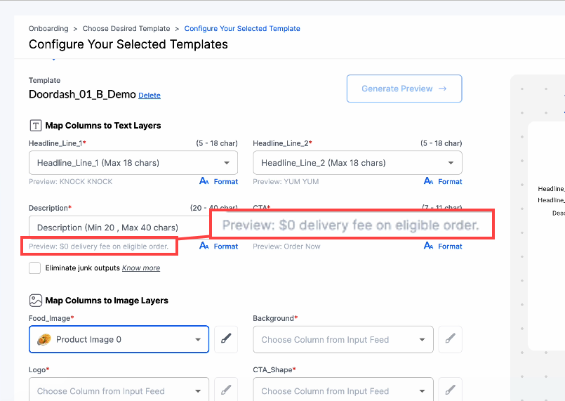

Customizing templates is a crucial step in the creative process as it allows you to tailor your input files to fit perfectly with the template layers. This involves carefully mapping each element of your creative, including the call-to-action (CTA), heading, logo, primary image, background image, and more. By customizing templates, you can inject your brand's unique designs and aesthetics, resulting in highly personalized and impactful creatives that truly represent your brand.

## Mapping Sheet Columns to Creative Elements

To begin customizing the template, you need to map the columns from your input sheet to the corresponding text and image layers. You can [preview](#peview) the first cell values from these columns, giving you a glimpse of how they'll appear in the creative. This step allows you to ensure the mapping is accurate and aligns with your content.

### Template Layers

Templates consist of two main layers:

**Text Layers:** These layers encompass the text elements you want to display in the creative, such as headings, descriptions, or calls-to-action.

**Image Layers:** These layers encompass the visual design of the creative, including background images, primary images, or logos.

> ℹ️ If you don't have any input for the text layers, you have two options. You can either keep the text as it is in the template or leave the space empty. Choosing to keep it empty will result in no text being displayed in your output files.

### Peview

Preview shows the first cell values of input file columns. It helps you correctly map the text layers.

### Eliminating Junk Values

During the customization process, it is important to eliminate any junk values that may be present in the sheet. Junk values refer to outputs that deviate significantly from the defined guidelines, such as text lengths that are either too short or too long. By removing these junk values, you can maintain the quality and consistency of your generated outputs. For more information, please refer to the [Input File](../quick_start/guide.md), which provides guidelines for text length and image proportions.

### Formatting Text Layers

You can format the text layers to enhance their visual presentation. You have the flexibility to add prefixes or suffixes to the text, choose alternative columns for customization, and apply text formatting or number formatting as needed.

### Customizing Image Layers

For the image layers, you can decide which sections of the template you wish to customize. To customize these sections, you should have corresponding alternative columns in your input file for the specific images. If you haven't added any columns for the logo or background image, you can simply use the default template images provided.

## Reviewing the Customized Template

Before scheduling the creative generation process, it's crucial to review the entire customized template. Take a moment to thoroughly examine all the changes you have made to ensure they accurately reflect your desired creative output. If you notice any missing or incomplete elements, you can easily edit them before proceeding.

- Edit the template
- Remove the template
- See template preview & sample outputs

### Relates articles:

[Schedule & Configure Outputs](output_file_config.md): This section explains how to schedule the generation of output files and configure the columns and names in the output file and setup notification.

For more details and examples, please contact us at [support@pixis.com](mailto:support@pixis.com).